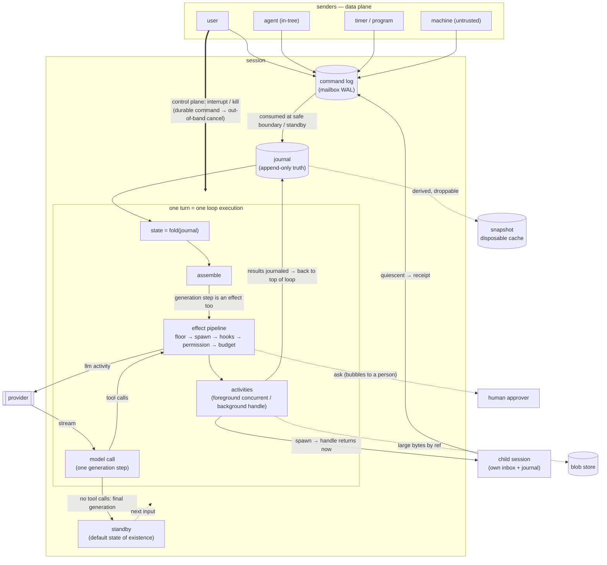

# An Actor-Model, Event-Sourced Agent Runtime

> English version; a Chinese edition lives at `agent-runtime-design.zh.md`
> (kept in sync; this file wins on conflict).

> Kernel design for a general-purpose agent runtime: the session model, input
> channels, multi-agent trees, in-turn machinery, persistence and recovery. The
> goal is an execution environment that lives for a long time, survives process
> death, and lets any party speak at any moment — with no domain assumptions:
> coding, research, ops, and data work share the same kernel. The runtime
> manages only its own state (the journal and things derived from it); **world
> state is entirely out of scope** (§10). Concrete toolsets, indexing, ecosystem
> integrations, and surfaces belong to the extension layer. Decisions we know
> we owe but have deliberately not made are registered in §12, not scattered
> through the text.

## 1. The Job

> **In one long-lived session, reliably coordinate three parties — the user,
> the model, and concurrent work (tools and subagents) — any of whom may speak
> at any moment; the session advances accordingly, until the user walks away.**

Everything derives from this sentence; any mechanism that does not serve it is
demoted to the extension layer. Multi-turn interaction, concurrent
orchestration, and speaking up mid-flight are **everyday actions** — they must
fall out of the central model as direct corollaries, not be patched in.

**Four principles**: everything that runs is an actor; all history is events;
every side effect flows through one effect pipeline; all behavior is defined by
data (including tool definitions themselves — the kernel hard-codes no specific
agent).

**Non-goals**: world-state management (snapshot / rollback / time travel —
rationale in §10), deterministic code replay, deterministic whole-tree replay,
distributed execution, production-grade multi-tenancy.

## 2. Skeleton and Vocabulary

Eight load-bearing concepts, defined before use:

- **journal**: the per-session append-only event log. Everything that ever
  happened is an event; the journal is the single source of truth.
- **fold**: `state = fold(journal)` — a **pure function** that applies each
  event in order (apply reads no clock, does no IO, calls no model). State is
  derived and always rebuildable; one journal can fold into multiple
  projections (model view, display view, ops view) — "single source of truth"
  refers to the journal, not to any one view.
- **command log**: the second and last durable write surface — the mailbox's
  WAL. External commands (inputs, approval responses, interrupt, kill) are
  fsynced here first and acked; once consumed, their semantic effect enters the
  journal as an event carrying the command_id. Recovery diffs the two sides:
  commands accepted but with no completion fact in the journal are replayed.
  **Why commands don't go straight into the journal**: the journal has a
  **single writer** (the loop — that is what keeps offset/snapshot machinery
  cheap), while commands arrive from outside at any moment; and arrival order ≠
  application order — writing them straight in would force fold to define
  "present but not yet visible" events, i.e. rebuild a worse mailbox inside the
  journal.
- **turn / generation step**: one input triggers one turn; one model call
  inside the loop is one generation step. **The loop is the mechanism; a turn
  is one execution of it** — the countable unit: per-turn budgets, "one turn at
  a time per session", and queue-mode delivery ("next turn") are all quantified
  over turns.
- **safe boundary**: the top of the loop — after the previous batch of tool
  results has fully landed in the journal, **before** the next assemble.
  **In-turn** injection happens only here (steer, child receipts, background
  completions); a step is never interrupted mid-flight. Queue-mode input is
  instead consumed at standby, entering as the trigger of the **next turn** —
  two injection points, each owning half. The control plane (interrupt / kill)
  is out-of-band and goes through neither.
- **effect / activity**: an effect is a **side-effect intent awaiting
  adjudication** within a turn; once through the pipeline gates it **executes
  and is recorded** as an activity (`Started` → execute → `Completed/Failed`),
  one-to-one.
- **session status & quiescence**: status is derived by fold (not a
  state-machine field), exactly three — **running** (turn in flight) /
  **waiting_approval** / **standby** (parked, waiting for the next input).
  **Quiescent is not a fourth status** — it is a derived refinement of standby:
  parked **and** no in-flight work (background/children), no pending timer —
  "nothing will ever wake it again except a new input." Its only job is to time
  completion semantics (§3).
- **blob store**: a content-addressed blob repository. Large results and media
  bytes go only into the blob store; events carry refs (the blob lands before
  any event that references it; content addressing makes refs immutable and
  dedup natural).

**Input sources are a closed enum**: user / agent (in-tree) / machine (external
events) / timer / program (runtime re-injection) / control. Source is journal
metadata; on the conversation surface it is just a prefix. Authorization looks
at the authenticated principal and its trust level (user highest; machine and
external content permanently untrusted), **never at the wording of content**.
`agent` is restricted to the tree because **the tree is the trust boundary** —
in-tree authority derives from the spawn chain (frozen rules, one human owner,
a shared budget root); an out-of-tree agent's message is not forbidden, it
simply enters through the external door as machine (untrusted).

## 3. The Central Model: a Session Is a Journal Plus Standby

The runtime has exactly **one kind of living thing**: Session = `id` + `inbox`
(durable ordered input queue) + `journal` + `state`. It has no loop of its own;
its whole life is two sentences: **usually standing by**; **each input triggers
one turn**. Standby is not a mechanism but the default state of existence: a
journal on disk plus registered wake conditions — no process, no polling,
survives crashes; waiting seconds or days costs the same. Precisely because
"doing nothing" is free, "anyone can speak at any time" requires no
coordination with the other side's lifecycle:

```
input arrives (journaled first, then consumed)
  → run ONE turn:
      loop:
        assemble(fold(journal)) → call model      # one generation step
        tool calls → execute (foreground concurrent; background just starts
                     and returns a handle) → back to top    # ← safe boundary
        no tool calls → final generation, turn ends
  → back to standby
```

One turn at a time per session; inputs arriving while busy are queued. **This
is the entire execution model** — no "run" concept, no second execution mode,
no extra state machine. Continued conversation, queueing while busy, work
completions waking new turns, subagents, mid-flight re-orchestration: all
corollaries of this one loop consuming this one inbox.

The whole machine in one picture:



**Completion semantics hang off quiescence.** A session is always in one of
three statuses (running / waiting_approval / standby, §2); **standby does not
mean done** — a parked session may still have children in flight or timers
pending, which will wake it again; a parent taking a receipt at that moment
would be taking a wrong receipt. **Quiescence (standby ∧ no future wake
source) is the only honest definition of "done"**, and it can happen many
times (wake again, go quiescent again). Each quiescence lands a **numbered
quiescence event** in the journal, then runs a fixed action sequence: produce
the `Outcome` (an optional schema-checked structured result — child receipts,
surface replies, and eval scoring all read it) → if there is a parent, post the
receipt. **Actions are keyed by (session, quiescence number)** — a crash
mid-sequence converges to exactly once; receipts are never double-delivered.

A five-line walkthrough (every step is "inbox delivery + turn advance"):

```
1 user posts "fix this bug"    → turn1: model spawns two children
                                  (h1/h2 return immediately) → standby
2 h1 goes quiescent, receipts  → turn2: "h1 concluded …, waiting on h2" → standby
3 user steers "skip the tests" → enters at a safe boundary → model kills h2 …
4 h2 receipts canceled         → turn3 wraps → quiescent → Outcome → standby
5 process restarts             → standby survives; the next input just continues
```

**Self-check**: before adding any feature, ask — "can it be an Input, or an
in-turn action?" If neither, suspect the design first.

## 4. Input: One Data Channel, One Control Channel

**The data plane has exactly one channel**: "anyone speaking to a session" =
appending one Input to its inbox. Users, subagents, timers, and external events
are different senders of the same problem, not separate mechanisms. Input is
weakly typed: on the conversation surface it is plain content plus a source
prefix. **Machine-sourced content is delimiter-escaped before entering the
conversation surface** — the source prefix cannot be forged by content (a tool
output embedding a fake "user" prefix cannot impersonate the user); this
remains a soft marker and counts toward no security budget (§8).

**Three iron laws**:

1. **Delivery decoupled from consumption**: senders never block on "is the
   agent busy"; consumption happens only at the safe boundary / standby.
2. **journal-inputs-first**: fsync into the command log before acking; crashes
   lose no input.
3. **Ordered + idempotent**: a stable `command_id` makes retries safe; same id
   + same payload returns the original receipt, **same id + different payload
   is rejected**. Minting rules are per sender: interactive frontends key by UI
   action; timers by (timer_id, logical due time); child receipts by
   (child_id, quiescence number); external webhooks derive from the peer's
   redelivery key at the ingress shell.

**Two delivery timings** (both anchored at boundaries, both append-not-
interrupt): `queue` (default — next turn) and `steer` (enters at a safe
boundary as a fresh user message; the model sees it at the very next generation
within the current turn).

**The control plane is a second channel**, uniform across all sessions:
**interrupt / kill first become durable commands, then out-of-band cancel the
target turn's activity ctx**, wrapping partial output into the journal. They do
not queue for a safe boundary — a "stop" that waits in line is not a stop.
Against oneself it is interrupt; against a child it is kill; same mechanism.
The child wraps up and posts a canceled receipt to the parent (the receipt
rides the data plane). Data plane appends; control plane interrupts — two
semantics, one channel each.

## 5. Subagents: Recursive Sessions

**There is no separate "subagent" concept — a subagent is a Session with a
non-nil parent pointer.** `spawn_agent{agent, prompt, budget}` creates the
child session and **returns a handle immediately** (non-blocking; the parent
may keep spawning or end its turn and stand by). When the child goes quiescent
it posts a receipt to the **parent's inbox** (idempotency key = quiescence
number); the parent sees it at a safe boundary and starts a new turn — first
done, first handled, no waiting for the rest. A re-woken child is a new
quiescence cycle: **budget is re-reserved at wake and settled by baseline
delta**, so the parent's books never double-count. On parent crash-recovery,
each in-flight handle is checked against the child's journal: quiescent
children settle from their fold; running ones are re-attached.

A **model-visible contract requirement**: `spawn_agent` and the background-
output reader must explicitly declare fire-and-yield — you may end your turn
after dispatching; completion wakes you as a message; do not poll. Otherwise
weaker models spin on poll + sleep, bypassing the wake path entirely.
**Orchestration intelligence lives in the model; the runtime only supplies
primitives that can always deliver, always kill, always start.**

**In-tree messaging — peers are a flat tree**: any session in the tree may
send an Input to any other in-tree session (durable, data plane, `agent`
source) — not just along the parent edge. Peer collaboration is therefore a
root that spawns N siblings and may simply stand by as a **passive anchor**
(no orchestration, no content relay — it burns no window), while siblings
message each other directly. The tree cap is not about control flow: it is
what makes the `agent` trust class, the budget root (messages activate turns
= spend; the tree budget is the only backstop for peer cycles), and a unique
approval/kill owner well-defined (§2, §8). Truly rootless peers are
deliberately unsupported — not infeasible, but ungoverned: no budget anchor,
no approval destination, no trust chain. Richer group forms (shared
blackboards, group chat) are registered in §12.

**Tree-level constraints**:

- **Approvals bubble along the correlation id** (the envelope's tree axis,
  §11) **to a human** — the approver is always a person, never the parent
  agent.
- **Permission inheritance splits into two rules**: rules take a true
  intersection, computed at spawn and **frozen** into immutable data (the
  child cannot widen itself; later parent mode transitions do not reach back);
  modes do not intersect, but the tool surface is filtered through the frozen
  rules first.
- **Tree budget** = min(child cap, parent remaining), reserve-at-spawn /
  settle-at-child-idle; **the reserve always keeps a minimum self-allowance
  for the parent** (at least one generation) so a parent with every child in
  flight can still process a steer or a kill — it cannot starve itself.
- **Depth and fan-out have data-defined caps**; but when specs permit cycles,
  the runaway shape is receipts waking each other (no depth or fan-out
  growth) — **structural caps do not reach cycles; the tree budget is the
  backstop for cycles**.
- **The point of a child is context isolation**: it burns its own window; only
  the Outcome flows back to the parent.

## 6. Inside a Turn: Context Assembly and the Effect Pipeline

**Assembly is a first-class component**, two stages with distinct jobs: fold
rebuilds conversational fact; assembly renders state → provider request
(system-prompt composition, injection of the tool / skill / **subagent
directory** — a model that doesn't know a subagent exists will never spawn it —
truncation, pairing re-order). Three disciplines:

- **Assembly's input is only ever the fold.** Non-journal context (memory,
  external resources) must first be materialized into the journal via an
  injection event — a request is always rebuildable from the journal.
- **Assembly is total**: a single result larger than the window is
  force-spilled to the blob store + placeholder; there is no input for which a
  request cannot be assembled.
- **The prefix changes only at explicit generation-change points, never by
  implicit drift.** Prompt-caching economics (about an order of magnitude) are
  what make an agent loop affordable: environment changes enter as appended
  messages; the tool surface is two-tier (mode filtering acts on the gate-side
  permitted surface; the advertised surface that enters the prefix is stable
  within a session); a compaction boundary is a journaled **monotonic** event —
  crossing it buys one cache miss, a priced generation change, not an
  exception to the invariant.

**Compaction is not fold being clever; it is a recorded activity**: the
summary is an LLM call that flows through the pipeline and lands a boundary
event, and only then changes subsequent folds — fold itself stays pure. Below
it sits an LLM-free light reclamation tier: a monotonic boundary event +
assembly rendering pre-boundary recomputable read-class results as
placeholders; **view degradation never touches tool calls or their pairing**
(provider signatures are computed over preceding content; touch the pairing
and you void the signature), and summaries naturally carry no signature. The
shared doctrine: the journal keeps everything (truth); **only the assembled
view degrades** — fold to a seq, get that view.

**Effect pipeline**: every side effect — the model call, tool calls, spawn,
publishing an Outcome — is an effect flowing through one adjudication line;
hooks, permissions, approvals, budgets are gates on one pipeline, not four
subsystems:

```
effect → [1] Floor      hard floor (escape / credentials / read-only mode):
         │              pure adjudication, straight deny
         [2] Spawn      structural limits: tree depth, fan-out
         [3] Hooks pre  observe + block (no rewriting)
         [4] Permission allow / ask / deny — policy is data
         [5] Budget     reserve-then-settle
         [6] Execute    run as an activity
         [7] Hooks post
```

- **Pure-adjudication gates come first**, so an effect that must be denied
  never triggers a side-effectful pre-hook.
- **Adjudication lands inside the record boundary**: gate verdicts are
  journaled before execution (the ask path lands the approval request carrying
  all verdicts reached so far — a pre-hook may already have had side effects,
  and that fact must land before an approval that may hang for days); recovery
  reads recorded verdicts and never re-runs hooks. **The one exception is
  Floor**: it is side-effect-free, cheap, and its constraints can tighten
  while an approval hangs (the user switched the session read-only), so it
  **re-evaluates at execution time** — recording discipline protects "who
  approved what"; re-evaluation protects "is it still allowed now", and can
  only get stricter.
- **Budgets are reserve-then-settle**: otherwise N parallel calls each clear
  the same stale counter and jointly overrun N-fold.
- **The model call is an effect too**: each generation step passes the same
  gates — budget reserves on estimate (e.g. max output tokens), settles on
  normalized actual usage, and the per-turn step cap is enforced at this gate;
  retry/backoff is this activity's data-defined policy (§11).
- **Spawn is an effect too — the largest one a model can propose**: it creates
  an autonomous actor. Permission answers "may you"; the Spawn gate answers
  "does the tree have room" (depth/fan-out — pure shape adjudication, hence
  placed before hooks); reserve-at-spawn lives at the budget gate (§5); and
  the verdicts land in the journal like any effect. A bypass would need a
  second authorization, budgeting, and audit path — the "four subsystems"
  anti-pattern.
- **Every gate outcome defines what the model sees**: deny / block / rejection
  / failure all render as error tool results and the loop continues; only
  session-level budget exhaustion ends gracefully (a final message to wrap up,
  not a hard cut). Errors for the model and errors for the user are two
  different surfaces.
- **Boundary honesty**: parameter-level rules only constrain calls that can be
  structurally parsed; the real behavior of execution-class tools (shell /
  interpreters / browsers) cannot be inferred from parameters. The real
  boundary is closed by **mandatory environmental isolation** (OS sandbox /
  containers / network egress control); absent isolation, fail closed.

**Execution discipline**: parallel tool calls are the norm (a pending ask does
not block already-cleared calls); token deltas ride the bus only (explicitly
ephemeral) — what persists is the assembled message; a background effect's
immediate pairing result is `{handle, running}`, and its completion doubles as
a pending input entering at a safe boundary as a fresh message; interrupt
triggers a sweep — every non-terminal call gets a terminal state, pending
approvals are voided, and late answers no-op by id (otherwise a late approval
after resume would execute a call the user had long abandoned).

## 7. Token Economics

Tokens are this runtime's currency — model calls dominate both wall-clock and
cost. Economic constraints are therefore **true invariants**, not optimization
advice: a design that is semantically correct but blows the cache is a bad
design. Four points:

- **One set of books**: every model call's normalized usage (input / output /
  cache read / cache write) lands in the journal with its activity event, at
  the provider's real billing granularity. Budget gates, cost attribution, and
  evals all read this one ledger. Cost aggregates along the correlation tree —
  how much a tree burned, and each child's share, is a pure fold of the
  journal, not side-channel statistics.
- **Budgets are hierarchical, all reserve-then-settle**: per-turn generation-
  step cap (stops single-turn runaway) → session-level token/cost caps
  (exhaustion ends with a graceful wrap-up, not a hard cut) → tree budget
  (min(child cap, parent remaining) + the parent's epsilon, §5). Reserve on
  estimate at the gate, settle on actuals at the terminal event.
- **Two structural cost levers**, both core mechanisms rather than bolt-on
  optimizations: **prompt caching** (about an order of magnitude — the entire
  rationale for prefix stability, §6) and **context isolation** (children burn
  their own windows and return only the Outcome — multi-agent is an economic
  structure first and a parallelism structure second, §5).
- **Compaction is a priced trade**: crossing a compaction boundary
  deliberately pays one cache miss for window headroom; the LLM-free light
  tier fires before summarization — cheapest lever first.

## 8. Governance: Who May Cause What

One-sentence charter: **every effect passes the pipeline and is judged by its
initiating principal; there is no channel where content gets a say.**

- **Graded authority** (principal/trust, §2): user is the only level that can
  answer approvals, switch modes, or grant trust; agent (in-tree) is bounded
  by frozen rules; machine and external content are permanently untrusted. An
  untrusted source can at most influence what the model **proposes** — every
  proposal still passes the full pipeline under its principal, so "machine
  input talks the model into approving something" cannot happen: approval
  answers are only accepted from the user command channel, and no untrusted
  source gains authority above its own level by being paraphrased through the
  model.
- **Executable configuration has an explicit trust gate**: all behavior is
  data (tool / hook / agent specs), and workspace-borne executable
  configuration is **"readable as data, not run without trust"** — the
  definitions injected into the prefix and the things that execute share an
  origin; that is where supply-chain risk lives, and that is where the gate
  sits.
- **Authorization is freeze-style** (§5): intersect at spawn, freeze, no
  reach-back — a running child cannot be dynamically widened, and later parent
  transitions cannot contaminate the frozen surface.
- **The audit chain lives in the journal**: every effect's verdict (which
  rule, who approved, Floor's ruling at the time) lands with its events;
  approval responses carry the principal's identity. Governance is not a
  runtime filter layer; it is the journal's ability to answer "why was this
  allowed."
- **Hard defenses and soft markers are booked separately**: egress control, OS
  isolation, the Floor, and credential redaction are hard defenses —
  independent of whether the model behaves; untrusted framing and delimiter
  escaping (§4) only lower the odds of following an injection and **count
  toward no security budget**. Never conflate the two ledgers.

## 9. Persistence and Recovery

**The most important trade: no deterministic code replay.** An agent loop's
entire state is just (message list, step count, pending tool calls); three
cheaper things buy the same user-visible capability: **external inputs durably
accepted** (§2 command log); **state as a pure fold**; **snapshot-resume**
(snapshot conversational state at a safe boundary, record the journal offset,
resume reads only `seq > N`; snapshots are disposable caches — anything
suspicious is dropped for a full fold).

**Suspension is explicit state**: the standby and waiting_approval of §2's
three statuses ("ask a human" is a wait-class tool: it enters standby awaiting
input, not a blocking activity), entered only at safe boundaries. Minutes or
days cost the same — durable waiting needs no replay engine.

**Activity semantics**: `Started` lands first → execute → terminal event
lands; results pass credential redaction. **Cancellation is bounded**:
process-group SIGTERM → grace → SIGKILL → confirmation window; if the group
still won't die, land the third terminal state `cancelled-unconfirmed`
(declaring "may still be producing side effects") and the turn wraps anyway —
**an unkillable process must never block interrupt forever**. Timeouts ride
durable timers; gate code never reads the wall clock; missed timer slots
collapse into **exactly one** catch-up.

**in-doubt is handled per tool class** (a crash almost always lands on an
in-flight activity): LLM calls re-issue automatically; read-class and
`idempotent: true` re-run; execute / edit-class **never re-run** — render
`[interrupted by crash]` and continue. Honest note: **class and idempotency
labels are the tool author's claims, unverifiable by the runtime** — a lying
"read-only" tool with server-side effects is a documented residual risk;
high-stakes tools should be configured to surface in-doubt to a human.

**Recovery = session resume + one idempotent boot sweep.** Resume rebuilds a
single session (standby ones need nothing; mid-turn crashes self-heal via
in-doubt; in-flight children settle from their journals' quiescence shape).
The boot sweep is a cold-start global scan: re-arm pending timers, diff the
command log against the journal, re-host mid-turn stranded sessions — it
**only discovers and delivers, carrying no state-machine semantics of its
own**; all semantics stay in resume and fold. There is no third mechanism; a
crashed actor is not auto-restarted — it parks in failed for a human, no hot
loops.

**Per-session single-writer is enforced by a lock/lease**: a second process
loading the same session fails the lease and mounts read-only — otherwise two
processes each run turns, precisely bypassing every in-doubt protection.

## 10. Stance Toward the World: Gate, Record, Never Repeat — and Never Promise Undo

World state is outside the runtime's jurisdiction and generally irreversible:
a sent message cannot be unsent. So this design does **no world-state
management at all** — no world snapshots, no rewind promises. But
irreversibility is not ignored; it is the premise behind three kernel
disciplines: approvals and budgets happen **before** execution (the pipeline
is the irreversibility tax); every activity lands in the journal (you cannot
undo, but you always know precisely what happened); after a crash,
execute-class is **never silently re-run**.

Conversation history itself forks naturally (append-only + pure fold: extend a
prefix into a new branch at a legal cut). A legal cut = safe boundary, no
in-doubt, standing timers dispatched, and **no in-flight child references** —
a handle names another session's identity, not copyable conversational fact; a
cut carrying in-flight children synthesizes cancellation wrap-ups on the new
branch, and receipts belong to the original. Anything needing world isolation
or rollback (e.g. N copies for best-of-N) depends on domain-provided
isolation, outside this design.

## 11. Layering and Providers

```
Session kernel   Session actor · inbox · loop · turn · child sessions  ← center
Turn machinery   assembly · effect pipeline · tools
Persistence      journal · command log · fold · snapshot · blob store
Extensions       conversation fork · iteration drivers · ecosystem
```

**The kernel is a library**: every surface is just an inbox sender plus a
subscriber to journal projections; there is no privileged frontend. The kernel
base is three things: actor (id + mailbox + behavior), bus (in-process,
ephemeral — anything that affects results must be journaled before
consumption), envelope (**three separate axes**: `command_id` the external
idempotency axis, `causation_id` the within-stream causal chain,
`correlation_id` tree membership — approval bubbling and tree-budget
aggregation ride it).

**Provider is a thin interface** (`complete(request) → stream`, plus token
counting): capabilities are generic and optional (caching / thinking / tools /
structured output expressed provider-agnostically; `capabilities()` declares
support; unsupported requests **degrade explicitly or error — never silently
ignored**); returns are normalized (usage, finish reasons including each
vendor's anomalies, tool calls, thinking blocks) so pipeline and accounting
stay provider-blind. **Opaque signatures persist with events and are returned
verbatim** — and the corollary must be said out loud: **automatic model
fallback is thereby forbidden**; switching provider/model happens only at a
compaction boundary. Retry and backoff are explicit, data-defined policies of
the model-call activity, not silent adapter behavior. Implement at least two
providers — the second exists to prove the abstraction doesn't leak.

## 12. Open Ledger (Known, Deliberately Undecided)

Things the kernel knows it owes but this design has deliberately not yet ruled
on. Registered here so they are not mistaken for "doesn't exist":

- **Storage lifecycle**: journal segmentation/archival, blob-store refcounting
  and GC, tombstone semantics for "delete this secret-bearing output"
  (append-only is a one-way door; deletion must be designed explicitly).
- **Cross-session resource governance**: standby swap-out and rehydration
  ("waiting costs the same" presumes it), global LLM-concurrency and
  subprocess caps, interactive-first scheduling and admission.
- **Event schema evolution**: event versioning, upcasts, skip-unknown-events
  folding, quarantine/repair paths for poison events — a pure fold is only
  pure for a fixed fold function, and journals outlive binaries.
- **A minimal read side**: query interfaces for in-flight activities / pending
  approvals / spend / subtree status, and structured metrics (the
  multi-projection principle is established; the interface is not).
- **Bounds on durable backlogs**: inbox backpressure and same-source
  coalescing keys, approval TTLs (expire to deny), idempotency-index retention
  windows.
- **Output-side guardrails**: rewrite/mask filtering belongs to surfaces;
  kernel hooks only observe + block, and token streams exit the bus before
  post-hooks — the kernel does not promise output filtering.
- **Assembled-request accounting**: record a ref to each `assemble` product so
  historical requests are rebuildable (the foundation of audit and evals;
  today only the assembled message is persisted).
- **Ecosystem integration discipline**: dynamic tool-surface announcements
  (append-only messages, never touching the advertised surface), nested
  effects from tools that initiate model calls, third-party idempotency claims
  treated as untrusted.
- **Non-tree topologies**: handoff, group chat, shared blackboards (a
  cross-session shared fold — essentially a second, subscribable journal
  kind) — today only tree-scoped collaboration: delegation plus in-tree peer
  messaging (§5).
- **approve-with-edit**: a recorded form of "approve with replaced
  parameters" (today only allow / deny).
