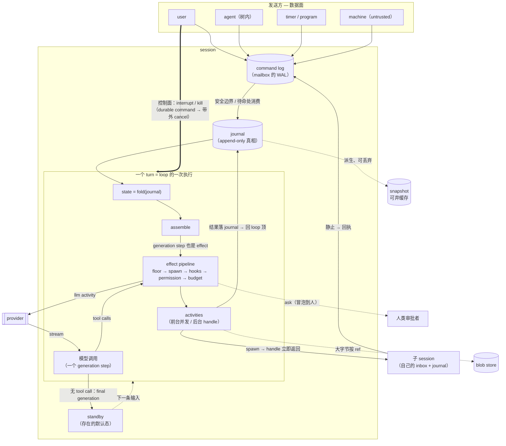

# An Actor-Model, Event-Sourced Agent Runtime

> 中文版；英文版见 `agent-runtime-design.md`（两版同步维护，冲突时以英文版为准）。

> 一个通用 agent runtime 的内核设计：会话模型、输入通道、多 agent、turn 内
> 机制、持久化与恢复。目标是长期驻留、挺过进程死亡、支持多方随时插话的执行
> 环境，不预设领域——写码、研究、运维、数据工作共用同一个内核。runtime 只
> 管理自己的状态（journal 及其派生物），**世界状态完全不在管理范围内**（§10）。
> 具体工具集、索引、生态接入、各类 surface 属于扩展层；已知而未做的决定
> 集中登记在 §12，不散落正文。

## 1. 本分

> **在一个长期存在的会话里，可靠地协调三方——用户、模型、并发的工作（工具
> 与子 agent）——任何一方随时可以说话，会话据此持续推进，直到用户离开。**

全部设计从这句话推导；不服务于它的机制降级为扩展层。多轮交互、并发编排、
随时插话是**日常动作**，必须是中心模型的直接推论，而不是补丁。

**四条原则**：一切可运行的是 actor；一切历史皆 event；一切副作用流经同一条
effect pipeline；一切行为由数据定义（含 tool 定义本身，内核不硬编码任何具体
agent）。

**非目标**：世界状态管理（快照/回滚/时间旅行，理由见 §10）、确定性 code
replay、整树确定性 replay、分布式执行、生产级多租户。

## 2. 骨架与词汇

八个承重概念，先定义后使用：

- **journal**：per-session 的 append-only event log。发生过的一切都是一条
  event；journal 是唯一真相。
- **fold**：`state = fold(journal)`——从头依次 apply 每条 event 得到 state 的
  **纯函数**（apply 不读时钟、不做 IO、不调模型）。state 是派生物，永远可重建；
  同一 journal 可以 fold 出多个投影（模型视图、展示视图、运维视图），"唯一
  真相"指 journal，不指某一个视图。
- **command log**：journal 之外的第二个持久写入面——mailbox 的 WAL。外部
  命令（输入、审批应答、interrupt、kill）先 fsync 到这里、返回回执；被消费后
  其语义效果作为 event 进 journal 并携带 command_id。恢复时对比两边：已
  accept 而 journal 里无完成事实的命令重放。**为什么不直写 journal**：journal
  是**单写者**的（loop 是唯一写者——单写者才有便宜的 offset/snapshot 机制），
  命令却随时从外部到达；且到达序 ≠ 应用序——直写就得让 fold 定义"在场但不可
  见"的事件，等于在 journal 里重建一个更差的 mailbox。
- **turn / generation step**：一条输入触发一个 turn；loop 内一次模型调用是
  一个 generation step。**loop 是机制，turn 是它的一次执行**——可计数的
  单位：per-turn 预算、"同 session 同时只跑一个 turn"、queue 进"下个 turn"
  都量化在它上面。
- **安全边界**：loop 顶部——上一批 tool result 已全部落 journal、下一次装配
  **之前**的那个点。**turn 内**的注入只发生在这里（steer、子回执、后台完成），
  绝不打断 step 中途；排队（queue）输入则在**待命处**消费、作为下个 turn 的
  触发进入——两个注入点，各管一半。控制面（interrupt/kill）带外，不经注入点。
- **effect / activity**：effect 是 turn 内一个**待判定的副作用意图**；过完
  管线关卡后以 activity 形态**执行并记录**（`Started` → 执行 → `Completed/
  Failed`），两者一一对应。
- **session 状态与静止**：状态是 fold 派生的（不是状态机字段），恰好三种
  ——**running**（turn 在飞）/ **waiting_approval**（等审批）/ **standby**
  （待命，等下一条输入）。**quiescent（静止）不是第四种状态**，是 standby 的
  派生细分：待命**且**无在飞工作（后台/子）、无未到期 timer——"除了新输入，
  没有任何东西会再唤醒它"。它唯一的作用是给完成语义定时机（§3）。
- **blob store**：内容寻址的 blob 仓库。大结果与媒体字节只入 blob store，
  event 存 ref（blob 先于引用它的 event 落盘；内容寻址使 ref 不可变、天然
  去重）。

**输入来源是封闭枚举**：user / agent（树内）/ machine（外部事件）/ timer /
program（runtime 回灌）/ control。来源是 journal 元数据；对话面上只是一个
前缀。权限判定看经认证的 principal 与其 trust 级（user 最高、machine 与外部
内容恒 untrusted），**绝不看内容措辞**。`agent` 限树内，因为**树是信任边界**
——树内权威来自 spawn 链（冻结的 rules、同一个人类 owner、共享预算根）；
树外 agent 的消息不是被禁止，而是只能走外部入口、以 machine（untrusted）
进入。

## 3. 中心模型：Session = journal + 待命

整个 runtime 只有**一种活的东西**：Session = `id` + `inbox`（持久有序输入
队列）+ `journal` + `state`。它没有自己的循环，一生只有两句话：**平时待命**；
**每条输入触发一个 turn**。待命不是一个机制，是存在的默认态：盘上的 journal
+ 已登记的唤醒条件——不占进程、不轮询、跨崩溃，等几秒或几天成本相同。正因为
"什么都不做"零成本，"任何一方随时说话"才不需要协调对方的生命周期：

```
输入到达（先落 journal，再被消费）
  → 跑 ONE turn:
      loop:
        assemble(fold(journal)) → 调模型        # 一个 generation step
        有 tool call → 执行（前台并发；后台只启动，拿 handle 即返回）
                     → 回 loop 顶               # ← 安全边界
        无 tool call → final generation，turn 结束
  → 回到待命
```

同一 session 同时只跑一个 turn，忙时到达的输入排队。**这就是全部执行模型**
——没有 "run" 概念、没有第二种运行形态、没有额外状态机。续聊、忙时排队、
工作完成激活新 turn、子 agent、中途改编排，都是这一个循环的推论。

整台机器一张图：



**完成语义挂在静止上**。session 恒处于三态之一（running / waiting_approval /
standby，§2）；**standby 不等于完成**——待命的 session 可能子还在飞、timer
未到，它们会再唤醒它，父此刻收回执就是错的回执。**静止（standby ∧ 无未来
唤醒源）才是"完成"唯一诚实的定义**，且可发生多次（再唤醒、再静止）。每次
静止在 journal 落一条**带序号的静止事件**，随后跑固定动作：产出 `Outcome`
（可选带 schema 的结构化结果——子回执、surface 应答、评测记分都读它）→ 有
parent 则投回执。**动作以 (session, 静止序号) 为幂等键**——崩溃后重跑收敛为
一次，回执不重复投递。

一个五行走查（每一步都是"inbox 投递 + turn 推进"）：

```
1 用户投 "修这个 bug"       → turn1: 模型 spawn 两个子（h1/h2 立即返回）→ 待命
2 h1 静止投回执              → turn2: "h1 结论是…，继续等 h2" → 待命
3 用户 steer "别管测试了"    → 安全边界进对话 → 模型 kill(h2)、继续
4 h2 投 canceled 回执        → turn3 收尾 → 静止 → Outcome → 待命
5 进程重启                   → 待命跨进程存活，下一条输入直接接续
```

**自检**：加功能前先问——"它能不能是一条 Input，或一个 turn 内动作？"都不能，
先怀疑设计错了。

## 4. 输入：一条数据通道，一条控制通道

**数据面只有一条通道**："任何一方对 session 说话" = 往 inbox 投一条 Input。
用户、子 agent、timer、外部事件是同一个问题的不同发送方，不是几套机制。
Input 是弱类型的：对话面上就是纯内容 + 来源前缀。**机器来源的内容进对话面前
做定界转义**——来源前缀不可由内容伪造（工具输出里嵌一段假 "user" 前缀不能
冒充用户）；这仍是软标记，不计入安全预算（§8 治理）。

**三条铁律**：

1. **投递与消费解耦**：发送方从不阻塞在"agent 忙不忙"上；消费只在安全边界。
2. **journal-inputs-first**：先 fsync 进 command log 再回执，崩溃不丢输入。
3. **有序 + 幂等**：稳定 `command_id` 保证重试不双执行；同 id 同 payload 返回
   原回执，**同 id 异 payload 一律拒绝**。id 的铸造规则按发送方给定：交互
   前端按 UI 动作；timer 按 (timer_id, 逻辑到期时刻)；子回执按 (child_id,
   静止序号)；外部 webhook 由 ingress 壳从对方的重投键派生。

**投递时机两档**（都锚在安全边界、都是追加不是打断）：`queue`（默认，进下个
turn）与 `steer`（安全边界以新 user 消息进对话，本 turn 内下个 generation
就看到）。

**控制面是另一条通道**，对所有 session 一致：**interrupt / kill 先成为
durable command，再带外 cancel 目标 turn 的活动 ctx**，把部分输出收尾进
journal。它们不排队等安全边界——排队的"停"不是停。对自身叫 interrupt，对子
叫 kill，同一机制；子收尾后向父投 canceled 回执（回执走数据面）。数据面
追加、控制面打断，两种语义，各一条通道。

## 5. 子 Agent：递归的 Session

**没有"子 agent"这个独立概念——它就是 parent 指针非空的 Session。**
`spawn_agent{agent, prompt, budget}` 创建子 session 并**立即返回 handle**
（非阻塞；父可继续 spawn 或直接结束 turn 回待命）；子静止时向**父 inbox**
投回执（幂等键 = 静止序号），父在安全边界看到并起新 turn——先完成的先处理，
不等全体。子被再次唤醒 = 新的静止周期：**按唤醒时点重新 reserve 预算、按
baseline delta 结算**，父账不双计。父崩溃恢复时对每个在飞 handle 查子
journal：已静止则从子 fold 结算，还在跑则重新挂接。

一条**模型可见面的契约要求**：`spawn_agent` 与读后台输出的工具必须显式声明
fire-and-yield——派完可结束 turn、完成会作为消息自动唤醒、无需轮询。否则弱
模型会用轮询 + sleep 自旋，把自动唤醒路径整个架空。**编排的智能在模型，
runtime 只提供"随时能投、能杀、能起"的原语。**

**树级约束**：

- **审批沿 correlation id**（envelope 的树归属轴，见 §11）**冒泡到人**——审批
  的永远是人，不是 parent agent。
- **权限继承拆两条规则**：rules 做真交集、spawn 时**冻结**成不可变数据（子
  无法自行放宽，父事后的 mode 跃迁不回溯）；mode 不交集，但工具面先过冻结
  rules。
- **树预算** = min(子限额, 父剩余)，reserve-at-spawn / settle-at-child-idle；
  **reserve 永远为父保留一个最小自用额度**（至少一次 generation），使父在
  全部子都在飞时仍能处理插话与 kill，不会把自己饿死。
- **深度与扇出有数据化上限**；但 spec 允许成环时，失控形态是回执互相唤醒
  （不增深度、不增扇出）——**结构上限管不到环，树预算才是环的兜底**。
- **子的意义在上下文隔离**：子烧自己的 window，只有 Outcome 回流父。

## 6. Turn 内：context assembly 与 effect pipeline

**Assembly 是一等组件**，两级分工：fold 重建对话事实，assembly 负责
state → provider 请求的全部渲染（system prompt 拼装、tool/skill/子 agent
**目录**注入——模型不知道某个子 agent 存在就永远不会 spawn 它、截断、配对
重排）。三条纪律：

- **assembly 的输入永远只有 fold**。非 journal 的上下文（记忆、外部资源）
  必须先经注入事件物化进 journal——请求永远可从 journal 重建。
- **assembly 是总函数**：单条超过 window 的结果强制 spill 到 blob store +
  占位符，不存在"装配不出请求"的输入。
- **prefix 只在显式换代点改变，绝不隐式漂移**。prompt caching 的经济性
  （约一个数量级）是 agent loop 可用的前提：环境变化以追加消息进上下文；
  工具面分两级（mode 过滤只作用于关卡侧的 permitted 面，进 prefix 的
  advertised 面 session 内稳定）；压缩边界是 journaled 的**单调**事件——
  跨过它接受一次 cache miss，这是定价过的换代，不是不变量的例外。

**压缩不是 fold 的聪明逻辑，是记录在案的 activity**：摘要是一次 LLM 调用，
走 pipeline、产出边界事件落 journal，之后才改变后续 fold 的视图——fold 始终
纯。另有一档无 LLM 的轻量回收：单调 boundary 事件 + assembly 把边界前可重算
的 read-class 结果渲染成占位符；**视图降级不动 tool call 与配对**（provider
的 signature 是对前置内容算的，动配对就废签名），摘要本身天然无 signature。
共同 doctrine：journal 留全量（truth），**只有装配视图降级**——fold 到哪个
seq 就得到哪个视图。

**Effect pipeline**：每个副作用都是一个 effect，流经同一条管线——hooks、
permission、审批、预算不是四个子系统：

```
effect → [1] Floor      硬底线（越界 / 凭据 / 只读模式）：纯判定，直接 deny
         [2] Spawn      结构限制：树深度、扇出
         [3] Hooks pre  observe + block（不改写）
         [4] Permission allow / ask / deny —— policy 是数据
         [5] Budget     reserve-then-settle
         [6] Execute    以 activity 执行
         [7] Hooks post
```

- **纯判定的关卡排最前**，必拒的 effect 绝不触发有副作用的 pre-hook。
- **判定落在记录边界之内**：关卡结论在执行前落盘（ask 路径先落审批请求并
  携带已完成的判定——pre-hook 可能已有副作用，这个事实必须先于可能挂几天的
  审批落盘）；恢复读记录值，不重跑 hook。**唯一例外是 Floor**：它无副作用、
  廉价、且约束可在挂起期间被收紧（用户切了只读模式），故**执行时刻重求值**
  ——记录纪律保护"谁批准了什么"的历史，重求值保护"现在还允许吗"的底线，
  且只能更严。
- **预算 reserve-then-settle**：否则 N 个并行 call 对着同一个过期计数器放行，
  合计超支 N 倍。
- **模型调用本身也是 effect**：每个 generation step 过同一排关卡——budget
  按预估预留（如 max output tokens）、按归一化实际 usage 结算，per-turn 的
  step 上限也在这道关卡执行；重试/退避是这个 activity 的数据化策略（§11）。
- **每种关卡结果都定义"模型看到什么"**：deny / block / 拒批 / 失败一律渲染
  成 error tool result，loop 继续；只有 session 级预算耗尽才优雅收尾。给
  模型的错误与给用户的错误是两个 surface。
- **边界诚实**：参数级规则只约束可结构化解析的调用；执行类工具（shell /
  解释器 / 浏览器）的行为无法从参数推断。真正的边界由执行环境的**强制隔离**
  （OS sandbox / 容器 / 网络出口控制）闭环，隔离缺席时 fail closed。

**执行纪律**：并行 tool call 是常态（ask 挂起不阻塞已放行的 call）；token
delta 只走 bus（显式 ephemeral），持久化的是组装完成的消息；后台 effect 的
立即配对结果就是 `{handle, running}`，完成时终态兼任 pending input、在安全
边界作为新消息进对话；interrupt 触发 sweep——所有未终态 call 得终态，未决
审批作废、迟到应答按 id no-op（否则恢复后一条迟到的批准会执行用户早已放弃
的调用）。

## 7. Token 经济

token 是这个 runtime 的货币——模型调用是墙钟与成本的绝对大头。经济性约束
因此是**真不变量**，不是优化建议：一个语义正确但打爆缓存的设计，就是坏
设计。四条：

- **记账真相只有一份**：每次模型调用的归一化 usage（input / output / cache
  read / cache write）随 activity event 入 journal，按 provider 真实计费
  口径。预算关卡、成本归因、评测都读这一份账，不另设计量。成本沿
  correlation 树聚合——一棵树烧了多少、每个子占多少，是 journal 的纯 fold，
  不是旁路统计。
- **预算层级化，全部 reserve-then-settle**：per-turn 的 generation step
  上限（防单 turn runaway）→ session 级 token/cost 上限（耗尽时让模型收尾
  的优雅停止，不是掐断）→ 树预算（min(子限额, 父剩余) + 父 epsilon，§5）。
  关卡时刻按预估原子预留、终态按实际结算。
- **两个结构性省钱杠杆**，都已是核心机制而非附加优化：**prompt caching**
  （约一个数量级——prefix 稳定不变量的全部理由，§6）与**上下文隔离**
  （子 agent 烧自己的 window、只有 Outcome 回流父——多 agent 首先是经济
  结构，其次才是并行结构，§5）。
- **压缩是定价过的交易**：跨压缩边界 = 主动付一次 cache miss 换 window
  余量；无 LLM 的轻量回收先于摘要触发——最便宜的手段先用。

## 8. 治理：谁能引发什么

一句话总纲：**每个 effect 都过管线、按发起 principal 判定；不存在"内容
说了算"的通道。**

- **权威分级**（principal/trust，§2）：user 是唯一能应答审批、切换 mode、
  授予 trust 的级别；agent（树内）受冻结 rules 约束；machine 与外部内容恒
  untrusted。不可信来源至多影响模型**提议**什么 effect——每个提议仍按
  principal 过全管线，故"机器输入诱导模型批准审批"不可能成立：审批应答
  只认 user 命令通道，不可信来源不能经模型转述获得高于自身级别的权限。
- **可执行配置有显式 trust 门**：一切行为由数据定义（tool / hook / agent
  spec），而来自 workspace 的可执行配置**"数据可读，代码不 trust 不跑"**
  ——注入 prefix 的定义与被执行的东西同源，供应链风险在这里，门也设在
  这里。
- **授权是冻结式的**（§5）：spawn 时算交集、冻结、不回溯——运行中的子不能
  被动态放宽，父的后续跃迁也污染不了已冻结的面。
- **审计链在 journal 里**：每个 effect 的判定（按哪条规则、谁批的、Floor
  当时的裁决）随 event 落盘，审批应答携带 principal 身份。治理不是运行时
  的一层滤网，是 journal 里可回答"为什么允许了这个"的记录。
- **硬防线与软标记分开记账**：egress 控制、OS 隔离、Floor、凭据 redaction
  是硬防线——与模型是否听话无关；untrusted 框定、定界转义（§4）只降低
  服从注入的概率，**不计入任何安全预算**。两类不得混记。

## 9. 持久化与恢复

**最重要的取舍：不做确定性 code replay。** agent loop 的全部状态不过是
（消息列表、step 计数、待处理 call），用三件更便宜的东西换到同样能力：
**外部输入 durable accepted**（§2 command log）；**state 是纯 fold**；
**snapshot-resume**（安全边界打对话 snapshot、记 journal offset，resume 只
读 `seq > N`；snapshot 是可弃缓存，可疑就丢掉走全量 fold）。

**挂起是显式状态**：即 §2 三态里的 standby 与 waiting_approval（"向人提问"
是 wait-class 工具：进入 standby 等输入，不是阻塞的 activity），都只在安全
边界进入。等几分钟或几天成本相同——durable 的等待不需要 replay 引擎。

**Activity 语义**：`Started` 先落盘 → 执行 → 终态落盘；结果过凭据 redaction。
**取消有上界**：进程组 SIGTERM → 宽限 → SIGKILL → 确认窗口；窗口尽仍不退
则落第三种终态 `cancelled-unconfirmed`（明示"可能仍在产生副作用"），turn
照常收尾——**绝不让一个不死进程把 interrupt 永久阻塞**。timeout 走 durable
timer，绝不在关卡代码读墙钟；漏掉的 timer slot 折叠成**恰好一次** catch-up。

**in-doubt 按 tool 类别处置**（崩溃几乎必然砸中 in-flight activity）：LLM
调用自动重发；read-class 与 `idempotent: true` 重跑；execute / edit-class
**不重跑**，渲染 `[interrupted by crash]` 让 loop 继续。诚实注记：**类别与
幂等标注是工具作者的声明，runtime 无法验证**——声明撒谎（"只读"工具在服务端
有副作用）导致的重复执行属文档化残余风险；高危工具应显式配置为 in-doubt
上浮转人工。

**恢复 = session resume + 一个幂等的 boot sweep**。resume 重建单个 session
（待命的无事可做；turn 中途崩的走 in-doubt 自愈；在飞子从子 journal 静止
形状结算）。boot sweep 是冷启动时的全局扫描：重挂未到期 timer、对账
command log 与 journal 的差集、接续 mid-turn 无宿主的 session——它**只做
发现与投递，不含状态机语义**，所有语义仍在 resume 与 fold 里。没有第三套
机制；actor 崩溃不自动 restart，停在 failed 等人，不热循环。

**per-session 单写者由锁/租约强制**：第二个进程加载同一 session 拿不到
租约即只读——否则双进程各自跑 turn，恰好绕过 in-doubt 的全部保护。

## 10. 对世界的姿态：把关、留痕、绝不重复——唯独不承诺撤销

世界状态不归 runtime 管辖，且一般不可逆：发出的消息无法收回。所以本设计
**完全不做世界状态管理**——没有世界快照、没有 rewind 承诺。但不可逆性不是
被忽略的，它是三条内核纪律的前提：审批与预算发生在执行**之前**（pipeline
就是"不可逆性税"）；一切 activity 落 journal（撤不了，但精确知道发生了
什么）；crash 后 execute-class **绝不静默重跑**。

对话历史本身天然可分叉（append-only + 纯 fold：在合法切点把前缀延伸成新支）。
合法切点 = 安全边界、无 in-doubt、standing timer 已处置、**无在飞子引用**
——handle 指向另一个 session 的身份，不是可复制的对话事实；切点带在飞子时，
新支对这些 handle 合成取消收尾，回执归原支。需要世界隔离或回滚的场景（如
best-of-N 的 N 份副本）依赖领域自带的隔离能力，在本设计之外。

## 11. 分层与 Provider

```
会话内核  Session actor · inbox · loop · turn · 子 session      ← 中心
Turn 机制 assembly · effect pipeline · 工具
持久化    journal · command log · fold · snapshot · blob store
扩展层    对话 fork · 迭代驱动 · 生态接入
```

**内核是库**：一切 surface 都只是 inbox 的投递方 + journal 投影的订阅方，
不存在特权 frontend。kernel 基座三件：actor（id + mailbox + behavior）、
bus（进程内、ephemeral——影响结果的输入必须先 journal 再消费）、envelope
（三轴分立：`command_id` 外部幂等轴、`causation_id` stream 内因果链、
`correlation_id` 树归属——审批冒泡与树预算聚合沿它走）。

**Provider 是薄接口**（`complete(request) → stream` + token 计量）：能力
通用且可选（caching / thinking / tools / structured output 以 provider 无关
方式表达，`capabilities()` 声明支持面，不支持时**明确降级或报错，绝不静默
忽略**）；返回归一化（usage、finish reason 含各家异常形态、tool call、
thinking 块），管线与记账不感知 provider。**opaque signature 随 event 持久
化并原样回传**——推论要说破：**自动 model fallback 被此禁止**，换 provider/
模型只能发生在压缩边界；重试与退避是模型调用 activity 的显式数据化策略，
不是 adapter 里的静默行为。至少实现两个 provider——第二个的唯一作用是验证
抽象不漏。

## 12. 留白登记（已知而未做的决定）

以下是内核已知需要、但本设计刻意尚未裁决的问题。登记在此是为了不被默认成
"不存在"：

- **存储生命周期**：journal 分段/归档、blob store 引用计数与 GC、"删掉这条
  含密输出"的 tombstone 语义（append-only 是单向门，删除必须显式设计）。
- **跨 session 资源治理**：standby 换出与 rehydrate（"待命成本相同"以此为
  前提）、全局 LLM 并发/子进程上限、交互优先的调度与准入。
- **event schema 演化**：event 版本号、upcast、未知事件跳过不 fold、毒事件
  的 quarantine/repair 路径——纯 fold 只对固定 fold 函数成立，journal 活得
  比二进制久。
- **读侧最小面**：in-flight activities / pending approvals / 花费 / 子树
  状态的 query 接口与结构化 metrics（多投影原则已立，接口未定）。
- **持久待办的上界**：inbox 背压与同源合流 key、审批 TTL（到期默认拒绝）、
  幂等索引保留窗口。
- **输出侧 guardrail**：改写/遮蔽类过滤归 surface 层；内核 hooks 只
  observe + block，token 流在 post-hook 之前即出 bus——内核不承诺输出过滤。
- **装配产物入账**：每次模型调用记录 `assemble` 产物的 ref，使历史请求可
  重建（审计与评测的根基；当前只落组装完成的消息）。
- **生态接入纪律**：动态工具面公告（只能追加消息、不得动 advertised 面）、
  工具内反向发起模型调用的嵌套 effect、第三方幂等声明视同 untrusted。
- **非树拓扑**：handoff、群聊、共享黑板——当前仅支持树形委派。
- **approve-with-edit**：批准并替换参数的记录形态（当前只有 allow/deny）。
